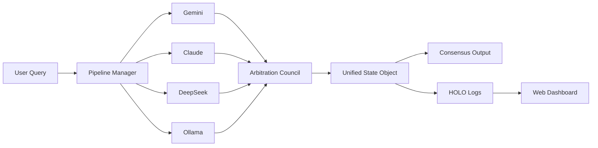

# ⚡ Zayden‑AI  
### *Federated Multi‑Model Cortex · Arbitration · HOLO‑Invariant Continuity*

[](https://opensource.org/licenses/MIT)
[](https://www.python.org/downloads/)
[]()
[](./docs/PRIOR_ART.md)

---

## 🧠 What is Zayden‑AI?

**Zayden‑AI** is the public‑facing, open‑source orchestrator for multi‑model AI inference. It acts as a **synthetic cortex** – taking queries, routing them to Gemini, Claude, DeepSeek, HuggingFace, or local Ollama models, and synthesizing a single, high‑quality consensus output via a **weighted Arbitration Council**.

Think of it as the *voice* of the Proteus ecosystem – clean, modular, and licensed MIT for your own projects.

---

## 🚀 Core Features

| Feature | Description |
| :--- | :--- |
| **Federated Inference** | Query multiple frontier models simultaneously. |
| **Arbitration Council** | Semantic alignment, coherence scoring, and consensus synthesis. |
| **Unified State Object** | JSON working memory with pipeline outputs, arbitration metrics, and final decisions. |
| **HOLO‑Invariant Continuity** | Tamper‑evident, append‑only logs (Merkle‑verified) – providing persistent, auditable memory across sessions. |
| **Live Web Dashboard** | Real‑time telemetry, ledger viewer, and engine status (Flask/Vue frontend). |
| **ProteusKernel Ready** | Can ingest kernel telemetry (optional) to adjust routing weights dynamically. |

---

## 🏛️ Architecture (Public Layer)



· zayden_holo/ – Continuity engine client (submodule).
· web/ – Dashboard and live telemetry.
· pipelines/ – Model adapters and configuration.

---

📦 Quick Start

```bash
# Clone the public orchestrator
git clone https://github.com/Admin135158/Zayden-AI.git
cd Zayden-AI

# Install dependencies
pip install -r requirements.txt

# Run a single inference
python zayden.py --model gemini "Explain quantum entanglement in one sentence"

# Run the Arbitration Council with 3 models
python zayden.py --council "What is the future of distributed AI?"

# Start the web dashboard (development)
cd web && python app.py
```

⚠️ Requires API keys for Gemini/Claude/DeepSeek (stored in .env – never commit them).

---

🗺️ Repository Structure (Public)

```
Zayden-AI/
├── docs/
│   └── PRIOR_ART.md          # 🔒 Legal timeline (Apr 2026 – present)
├── zayden_holo/              # HOLO-Invariant client (submodule)
├── zayden_soytu_ai/          # Legacy aggregator (retained for compatibility)
├── web/                      # Dashboard & telemetry UI
├── pipelines/                # Model adapters (Gemini, Claude, etc.)
├── .gitignore                # Blocks binaries, secrets, .env
├── ARCHITECTURE.md           # Deep dive into arbitration logic
├── CONTRIBUTING.md           # Guidelines for open‑source contributors
└── README.md                 # You are here.
```

---

<<<<<<< HEAD
For inquiries: [fernando@morpheus-innovations.com](mailto:fernando@morpheus-innovations.com)

## 🤝 Contributors

- **[Admin135158](https://github.com/Admin135158)** – Founder, Lead Architect (ProteusKernel, SYNC‑7, Digital Bodyguard, ElMalo)
- **[Deathburgerz013](https://github.com/Deathburgerz013)** – Creator of the **HOLO‑Invariant** continuity engine (append‑only logs, Merkle verification, tamper‑evident state)

The HOLO‑Invariant engine is the backbone of our audit and compliance capabilities. We thank Deathburgerz013 for their foundational contribution.

For a full list, see [CONTRIBUTORS.md](./CONTRIBUTORS.md).

=======
⚠️ Commercial Licensing Notice

Morpheus Innovations & Technologies Holdings LLC owns the proprietary multi‑agent kernel (proteuskernel-) and the offline intelligence mesh (ElMalo).

· ✅ The public MIT‑licensed code in this repo is strictly an API orchestrator and HOLO‑invariant client.
· ❌ The core swarm engine, Digital Bodyguard, heartbeat protocols, and offline mesh are not open‑source.
· 🔒 Commercial use, integration, or reverse‑engineering of those proprietary components requires a signed license from Morpheus Innovations LLC.

For licensing inquiries:
fernaaaathebeast@gmail.com

---

🗓️ Roadmap (Public)

☐ Dynamic arbitration learning (feedback loops)
☐ Multi‑agent council expansion (10+ models)
☐ Enterprise API endpoints (gRPC/REST)
☐ Distributed cognition clusters (Horizontally scaled)

---

📄 License (Public Part)

MIT License – Copyright © 2026 Morpheus Innovations & Technologies Holdings LLC.
See the full license in LICENSE.

But remember: the proprietary kernel and ElMalo are NOT covered by this license.

---

🌟 Recognition

This repository contains prior art (April 17, 2026) for:

· SYNC‑7 Swarm Protocol
· Multi‑agent shared memory (HOLO)
· Offline intelligence synthesis (ElMalo – Aug 12, 2026)

Read the full chronology in docs/PRIOR_ART.md.

---

Built with chaos, ordered by code.
© 2026 Morpheus Innovations & Technologies Holdings LLC.
>>>>>>> 02c76ecfa0a464d450c8e0b5f70a601f9f6a2c99
## 🔗 Community & Documentation

- [Code of Conduct](./CODE_OF_CONDUCT.md)
- [Contributing Guidelines](./CONTRIBUTING.md)
- [Security Policy](./SECURITY.md)
- [Roadmap](./ROADMAP.md)
- [Changelog](./CHANGELOG.md)
- [Issue Tracker](https://github.com/Admin135158/Zayden-AI/issues)
- [Discussions](https://github.com/Admin135158/Zayden-AI/discussions)
