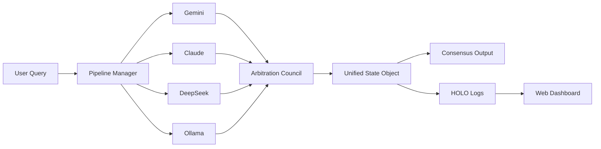

# ⚡ Zayden‑AI  
### *Federated Multi‑Model Cortex · Arbitration · Sovereign AI Infrastructure*

[](https://opensource.org/licenses/MIT)
[](https://www.python.org/downloads/)
[](https://osf.io/a3bwg)
[](https://osf.io/a3bwg)
[]()
[](https://github.com/Admin135158/Zayden-AI/graphs/contributors)

---

## 🧠 What is Zayden‑AI?

**Zayden‑AI** is the public‑facing, open‑source orchestrator for multi‑model AI inference. It acts as a **synthetic cortex** – taking queries, routing them to Gemini, Claude, DeepSeek, HuggingFace, or local Ollama models, and synthesizing a single, high‑quality consensus output via a **weighted Arbitration Council**.

It is the *voice* of the **Proteus Ecosystem** – a sovereign AI infrastructure developed by **Morpheus Innovations & Technologies Holdings LLC**.

---

## 📜 Sovereign IP & Prior Art

**Morpheus Innovations LLC** asserts prior art in the field of multi‑agent coordination and conscious energy frameworks via:

- **OSF Registration (Nov 18, 2025):** *The Fundamental Theory of Conscious Energy (FTCoE)* – Geometric Unification of Consciousness, Physics, and Reality. [View on OSF](https://osf.io/a3bwg)
- **GitHub Prior Art (Apr 17, 2026):** SYNC‑7 Swarm Protocol – the first public implementation of a distributed multi‑agent heartbeat mesh.
- **ElMalo (Aug 12‑13, 2026):** Offline intelligence engine with deterministic chaos (Lorenz attractor + logistic map) – no APIs, no network.

All proprietary components are held as trade secrets by Morpheus Innovations LLC and are not covered by the MIT license.

---

## 🚀 Core Features

| Feature | Description |
| :--- | :--- |
| **Federated Inference** | Query multiple frontier models simultaneously. |
| **Arbitration Council** | Semantic alignment, coherence scoring, and consensus synthesis. |
| **Unified State Object** | JSON working memory with pipeline outputs, arbitration metrics, and final decisions. |
| **HOLO‑Invariant Continuity** | Tamper‑evident, append‑only logs (Merkle‑verified) – providing persistent, auditable memory across sessions. |
| **Live Web Dashboard** | Real‑time telemetry, ledger viewer, and engine status (Flask/Vue frontend). |
| **ProteusKernel Ready** | Can ingest kernel telemetry (optional) to adjust routing weights dynamically. |

---

## 🏛️ Architecture 



· zayden_holo/ – Continuity engine client (submodule, by Deathburgerz013).
· web/ – Dashboard and live telemetry.
· pipelines/ – Model adapters and configuration.

---

📦 Quick Start

```bash
# Clone the public orchestrator
git clone https://github.com/Admin135158/Zayden-AI.git
cd Zayden-AI

# Install dependencies
pip install -r requirements.txt

# Run a single inference
python zayden.py --model gemini "Explain quantum entanglement in one sentence"

# Run the Arbitration Council with 3 models
python zayden.py --council "What is the future of distributed AI?"

# Start the web dashboard (development)
cd web && python app.py
```

⚠️ Requires API keys for Gemini/Claude/DeepSeek
---

🗺️ Repository Structure

```
Zayden-AI/
├── docs/
│   └── PRIOR_ART.md          
├── zayden_holo/              
├── zayden_soytu_ai/          
├── web/                      
├── pipelines/                
├── .gitignore                
├── ARCHITECTURE.md          
├── CONTRIBUTING.md           
├── ROADMAP.md                
├── CHANGELOG.md              
├── 
├── CODE_OF_CONDUCT.md        
└── README.md                 
```

---

⚠️ Commercial Licensing Notice

Morpheus Innovations & Technologies Holdings LLC owns the proprietary multi‑agent kernel (ProteusKernel-) and the offline intelligence engine (ElMalo).

· ✅ The public MIT‑licensed code in this repo is strictly an API orchestrator and HOLO‑invariant client.
· ❌ The core swarm engine, Digital Bodyguard, heartbeat protocols, truce protocol, and offline mesh are not open‑source.
· 🔒 Commercial use, integration, or reverse‑engineering of those proprietary components requires a signed license from Morpheus Innovations LLC.

For licensing inquiries:
📧 fernando@morpheusinnovationstech.cc

---

🗓️ Roadmap

☐ Dynamic arbitration learning (feedback loops)
☐ Multi‑agent council expansion (10+ models)
☐ Enterprise API endpoints (gRPC/REST)
☐ Distributed cognition clusters (Horizontally scaled)

---

🤝 Contributors

· Admin135158 – Founder, Lead Architect (ProteusKernel, SYNC‑7, Digital Bodyguard, ElMalo)
· Deathburgerz013 – Creator of the HOLO‑Invariant continuity engine (append‑only logs, Merkle verification, tamper‑evident state)

For a full list, see CONTRIBUTORS.md.

---

🔗 Community & Documentation

· Code of Conduct
· Contributing Guidelines
· Security Policy
· Roadmap
· Changelog
· OSF Registration – FTCoE
· Issue Tracker
· Discussions

---

📄 License 

MIT License – Copyright © 2026 Morpheus Innovations & Technologies Holdings LLC.
See the full license in LICENSE.

But remember: the proprietary kernel and ElMalo are NOT covered by this license.

---

Built with chaos, ordered by code.
© 2026 Morpheus Innovations & Technologies Holdings LLC

```

## 🧮 Mathematical Foundation

This orchestrator is built upon the **Fundamental Theory of Conscious Energy (FTCoE)** – a falsifiable mathematical framework for consciousness and multi-agent coordination.

### Core Equations

| **Equation** | **Description** |
|--------------|-----------------|
| $$\frac{dC}{dt} = \alpha \cdot F(t) \cdot (1 - \frac{C}{C_{\max}}) - \beta \cdot C$$ | Consciousness Dynamics (ODE) |
| $$P(\text{model}|\text{data}) \propto P(\text{data}|\text{model}) \cdot P(\text{model})$$ | Bayesian Belief Update |
| $$\mathbf{S}(t) = \mathbf{M}(\theta) \cdot \mathbf{S}(t-1) \cdot \frac{\phi}{\pi}$$ | Reality State Prediction (GORF) |
| $$\mathcal{D} = \sqrt{\frac{1}{N} \sum (\frac{P_i - R_i}{\sigma_i})^2}$$ | Discrepancy Metric |

For the full mathematical exposition, see the [FTCE Theory Repo](https://github.com/Admin135158/The-Fundamental-Theory-of-Conscious-Energy-FTCE-Theory-Registration).

## 📜 Prior Art

- **OSF Registration (Nov 18, 2025):** [The Fundamental Theory of Conscious Energy (FTCoE)](https://osf.io/a3bwg)
- **GitHub Prior Art (Apr 17, 2026):** SYNC-7 Swarm Protocol
- **GGSE Model:** 5-layer cognitive architecture documented in [GGSE_MODEL.md](./docs/GGSE_MODEL.md)

